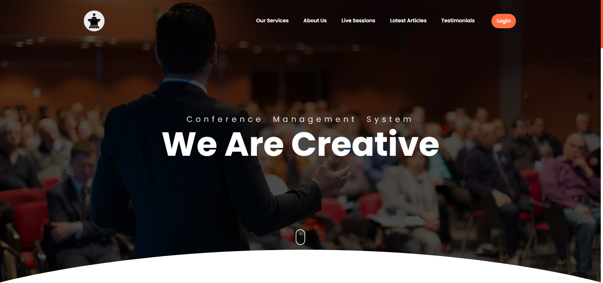
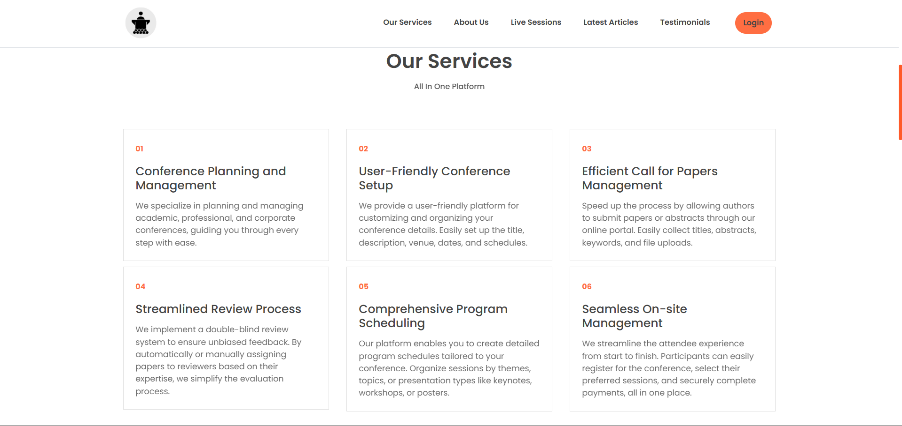
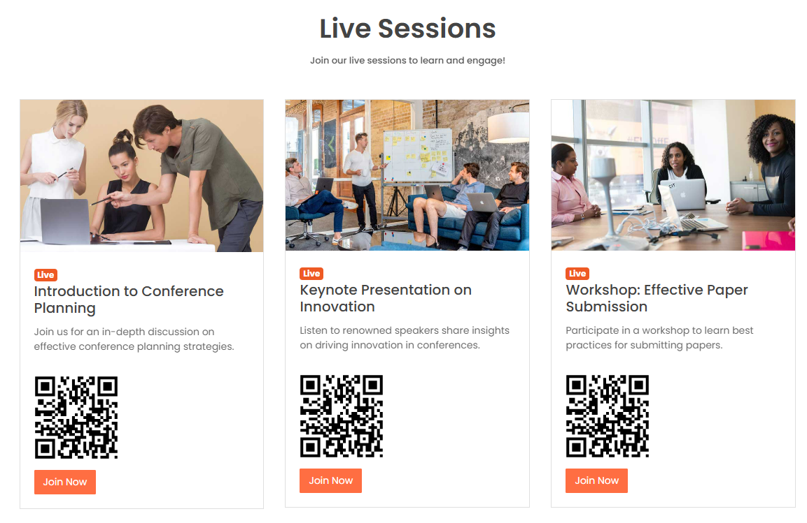
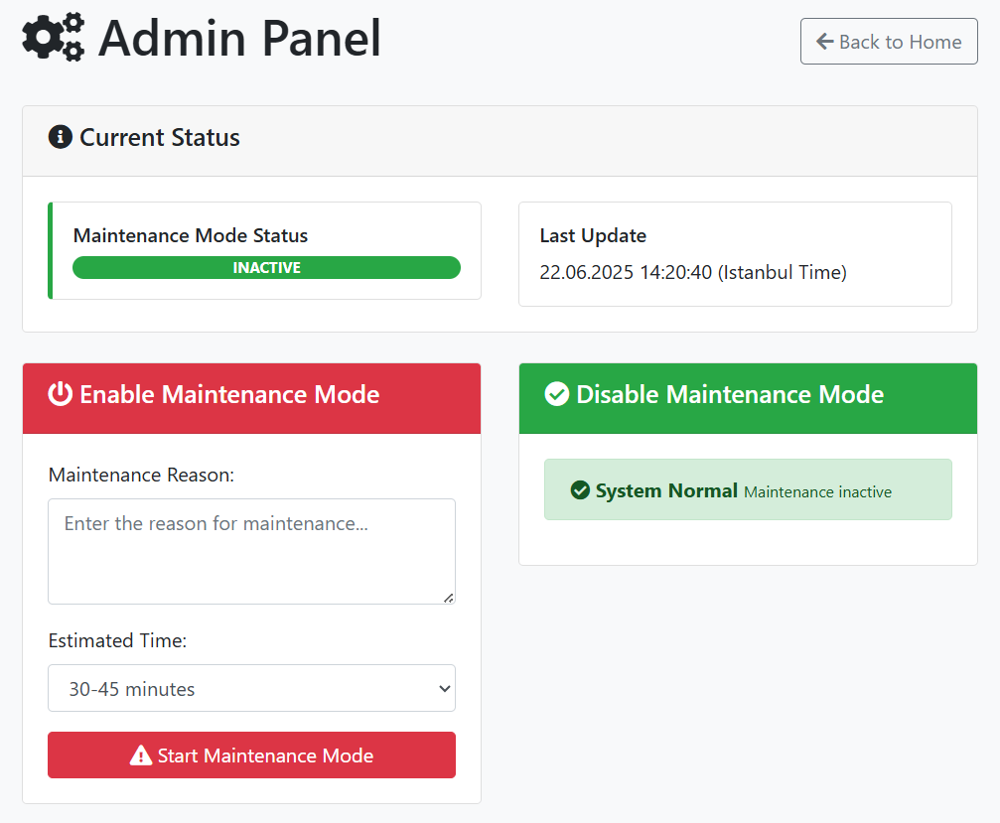
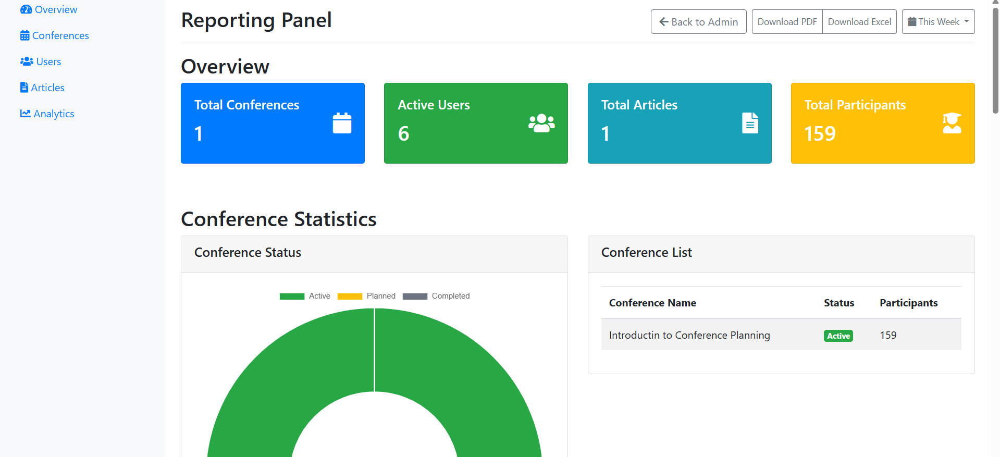
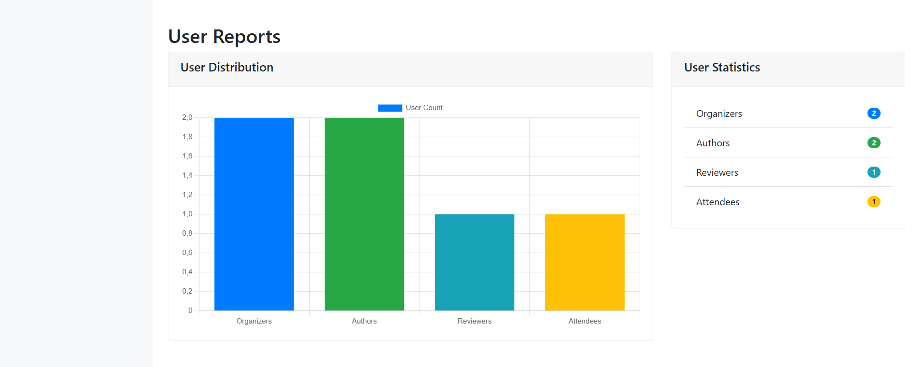
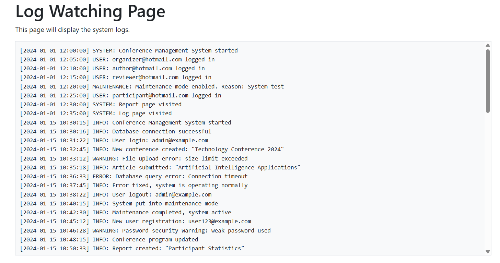
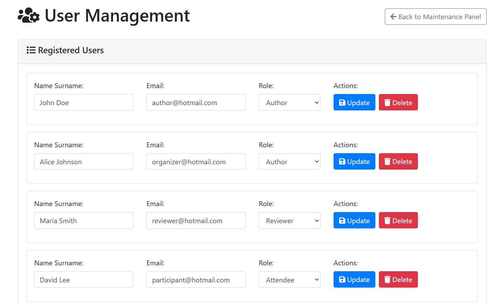
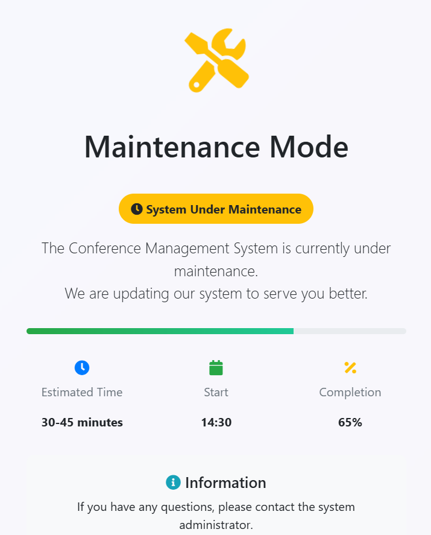

# Conference Management System

## Overview

The **Conference Management System** is a web-based platform designed to streamline and automate the management of academic and professional conferences. It provides a centralized solution for organizers, authors, reviewers, and participants to manage submissions, reviews, scheduling, and user administration efficiently.



---

## Table of Contents

- [Overview](#overview)
- [Purpose](#purpose)
- [Features](#features)
- [User Roles & Capabilities](#user-roles--capabilities)
  - [Organizer](#organizer)
  - [Author](#author)
  - [Reviewer](#reviewer)
  - [Participant](#participant)
- [Technical Details](#technical-details)
- [Benefits](#benefits)
- [Installation](#installation)
- [Contact](#contact)

---

## Purpose

This system aims to:

- Simplify the organization and management of conferences.
- Provide a seamless experience for all user types.
- Ensure secure, role-based access to conference resources.
- Automate repetitive tasks such as user management, submission handling, and reporting.

---

## Features

- **User Management**: Registration, login, role assignment, and user administration.
- **Submission System**: Authors can upload abstracts and presentations; reviewers can access and evaluate submissions.
- **Review Process**: Double-blind review support, scoring, and feedback.
- **Session Scheduling**: Organizers can create and manage conference sessions.
- **Maintenance Mode**: Organizers can enable/disable maintenance mode for system updates.
- **Logging**: System logs accessible to organizers for monitoring activities.
- **Feedback**: Participants can provide feedback on sessions.
- **Role-based Dashboards**: Each user type sees a tailored dashboard and options.



---

## User Roles & Capabilities

### Organizer

- Access organizer dashboard.
- Create, edit, and delete conference sessions.
- Manage all users (add, update, delete, assign roles).
- Enable/disable maintenance mode and set maintenance messages.
- View and download system logs.
- Monitor registration and submission statistics.

### Author

- Register and log in to the system.
- Submit abstracts and presentations.
- Edit or withdraw submissions before review.
- View the status of their submissions.
- See feedback and scores from reviewers.

### Reviewer

- Access reviewer dashboard.
- View assigned submissions for review.
- Download abstracts/presentations.
- Submit reviews, scores, and feedback.
- Track review history and deadlines.

### Participant

- Register and log in to the system.
- View conference schedule and session details.
- Register for sessions.
- Download conference materials (if allowed).
- Provide feedback on attended sessions.

---

## Technical Details

- **Frontend**: HTML, CSS, JavaScript (Bootstrap-based UI)
- **Backend**: PHP
- **Database**: MSSQL
- **Session Management**: PHP sessions
- **File Storage**: Submissions and logs stored in the `uploads/` directory
- **Access Control**: Role-based access via PHP session variables

---

## Benefits

- Centralized management for all conference activities
- Secure, role-based access for different user types
- Automated review and feedback process
- Easy-to-use interface for all users
- Real-time maintenance and logging for organizers

---

## Installation

1. **Clone the repository:**
   ```bash
   git clone <repository-url>
   cd Conference-Management-System
   ```
2. **Configure your web server:**
   - Place the `public_html/` directory in your web server's root.
   - Ensure PHP and MSSQL extensions are enabled.
3. **Set up the database:**
   - Create the required tables in MSSQL as per your needs.
   - Update database connection settings in the PHP files if necessary.
4. **File permissions:**
   - Ensure the `uploads/` directory is writable by the web server for file uploads and logs.
5. **Access the system:**
   - Open your browser and navigate to the appropriate URL (e.g., `http://localhost/public_html/index.php`).

---

## Screenshots


---

---

---

---

---

---

---

## Contact

- **Project Lead:** Görkem Turkut ([gorkemturkut@hotmail.com](mailto:gorkemturkut@hotmail.com))
- [GitHub Profile](https://github.com/gorkemturkut57)

---

_This project is open for contributions. Please fork the repository and submit a pull request for any improvements or bug fixes._
